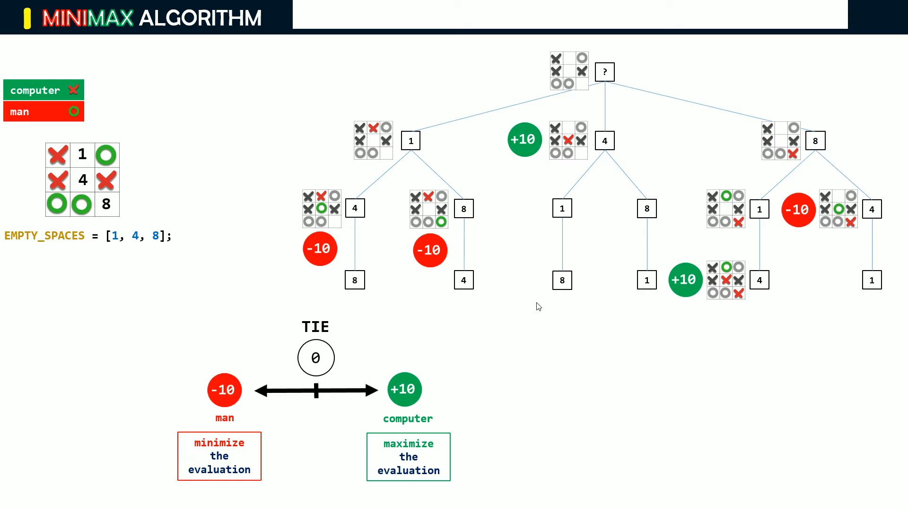

# Tic Tac Toe AI with Minimax Algorithm

The is a JavaScript Project for [The Odin Project](https://www.theodinproject.com/).

If you have never played TicTacToe before (hard to believe
), check out [How to Play!](https://www.exploratorium.edu/brain_explorer/tictactoe.html).

## Minimax
This project uses the Minimax Algorithm and backtracks every possible path and evaluates with minimum and maximum values and selects a move accordingly.

#### To Give a Visual Representation

This is how the minimax algorithm works for this project.


</br>

To Read more -
- [GeeksforGeeks](https://www.geeksforgeeks.org/minimax-algorithm-in-game-theory-set-1-introduction/)
- [Minimax Wiki](https://en.wikipedia.org/wiki/Minimax)

#### Information  
I started the project with just making the simple version of Tic Tac Toe, you can play the simple by cloning the repo.

```
$ git clone https://github.com/AnimeshRy/TicTacToe-Minimax
$ cd simple
$ live-server
```

Try the full Game [Here](https://animeshry.github.io/TicTacToe-Minimax/)


